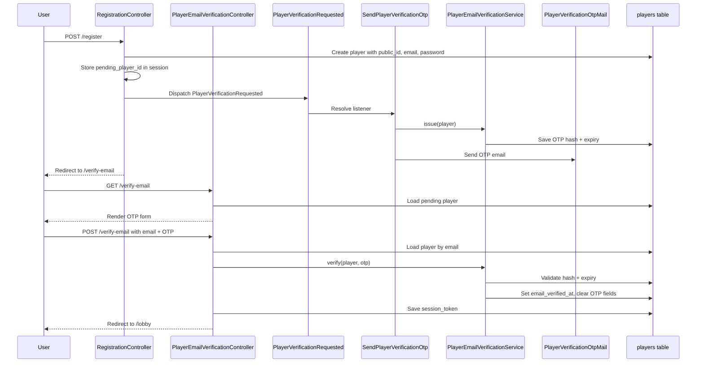
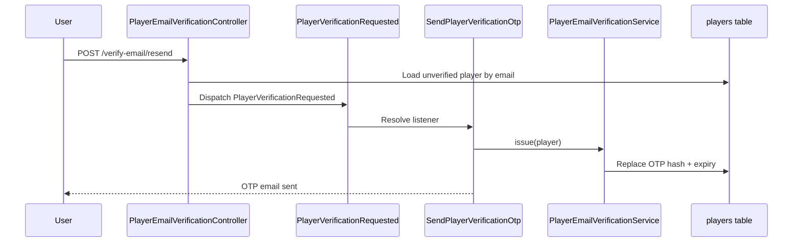

# Player Email Verification Flow

This document describes the email-based player registration and OTP verification flow used by the application.

## Purpose

- Require a valid email address during player registration
- Prevent lobby access until the email address is verified
- Generate a separate unique player identifier with `public_id`
- Deliver OTP codes through Laravel events and listeners

## Core Files

### HTTP Entry Points
- `routes/web.php`
- `app/Http/Controllers/RegistrationController.php`
- `app/Http/Controllers/PlayerAuthController.php`
- `app/Http/Controllers/PlayerEmailVerificationController.php`

### Domain / Persistence
- `app/Models/Player.php`
- `database/migrations/2026_03_12_120000_add_email_verification_fields_to_players_table.php`

### Event-Driven OTP Delivery
- `app/Events/PlayerVerificationRequested.php`
- `app/Listeners/SendPlayerVerificationOtp.php`
- `app/Services/PlayerEmailVerificationService.php`
- `app/Mail/PlayerVerificationOtpMail.php`
- `app/Providers/EventServiceProvider.php`

### Views
- `resources/views/players/register.blade.php`
- `resources/views/players/verify.blade.php`
- `resources/views/emails/players/verification-otp.blade.php`

## Data Model

The `players` table includes these verification-related fields:

- `public_id`: unique external player identifier
- `email`: unique email address
- `email_verified_at`: timestamp set after successful OTP verification
- `email_verification_code`: hashed OTP value
- `email_verification_expires_at`: OTP expiry timestamp

## Routes

### Registration
- `GET /register` -> `players.register.form`
- `POST /register` -> `players.register`

### Verification
- `GET /verify-email` -> `players.verification.notice`
- `POST /verify-email` -> `players.verification.verify`
- `POST /verify-email/resend` -> `players.verification.resend`

### Login Fallback
- `POST /login` -> `players.login`
- If the player exists but is still unverified, login is blocked and a fresh OTP is sent.

## Registration Flow

1. User submits username, email, password, and password confirmation.
2. `RegistrationController@store` validates input and creates the player.
3. The controller stores `pending_player_id` in session.
4. The controller dispatches `PlayerVerificationRequested`.
5. The listener generates an OTP, stores its hash and expiry, and sends the email.
6. The user is redirected to `/verify-email`.

## Listener Chain

### Event dispatch
- Source: `app/Http/Controllers/RegistrationController.php`
- Event: `PlayerVerificationRequested`

### Event registration
- `app/Providers/EventServiceProvider.php`

### Listener execution
- Listener: `SendPlayerVerificationOtp`
- Calls: `PlayerEmailVerificationService::issue($player)`
- Effect:
  - creates a 6-digit OTP
  - hashes and stores it
  - sets expiry to 10 minutes
  - sends `PlayerVerificationOtpMail`

## OTP Verification Flow

1. User opens `/verify-email`.
2. `PlayerEmailVerificationController@show` loads the pending player from session.
3. User submits email + OTP.
4. `PlayerEmailVerificationController@verify` calls `PlayerEmailVerificationService::verify`.
5. Service checks:
   - code exists
   - code has not expired
   - OTP matches the stored hash
6. On success:
   - `email_verified_at` is set
   - OTP fields are cleared
   - a fresh `session_token` is created
   - `player_id` and `player_token` are stored in session
7. User is redirected to the lobby.

## Login Flow for Unverified Players

1. User submits username + password to `/login`.
2. `PlayerAuthController@login` validates credentials.
3. If the player is still unverified:
   - session login is not completed
   - `pending_player_id` is stored
   - `PlayerVerificationRequested` is dispatched again
   - the user is redirected to `/verify-email`

## Sequence Diagram

## Resend Flow Diagram

## Operational Notes

- OTPs are currently 6 digits and valid for 10 minutes.
- OTP values are never stored in plain text in the database.
- The current login identifier is still `username`; email is required for registration and verification.
- Mail delivery depends on `MAIL_MAILER` and related mail settings in `.env`.
- In local development, the project can use Mailpit on SMTP port `1025` with a browser UI on `http://127.0.0.1:8025`.
- The current local default can use Laravel's `failover` mailer so Mailpit is tried first and `log` is used if Mailpit is unavailable.

## Testing

Current feature coverage exists in:

- `tests/Feature/PlayerRegistrationTest.php`

That test covers:
- registration creates an unverified player and sends OTP mail
- OTP verification marks the email as verified and starts the player session
