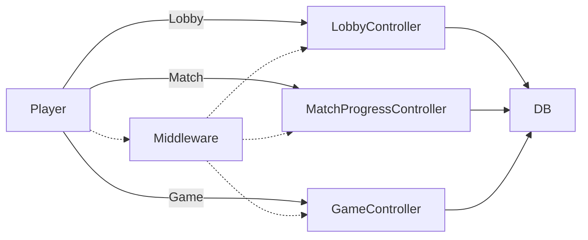
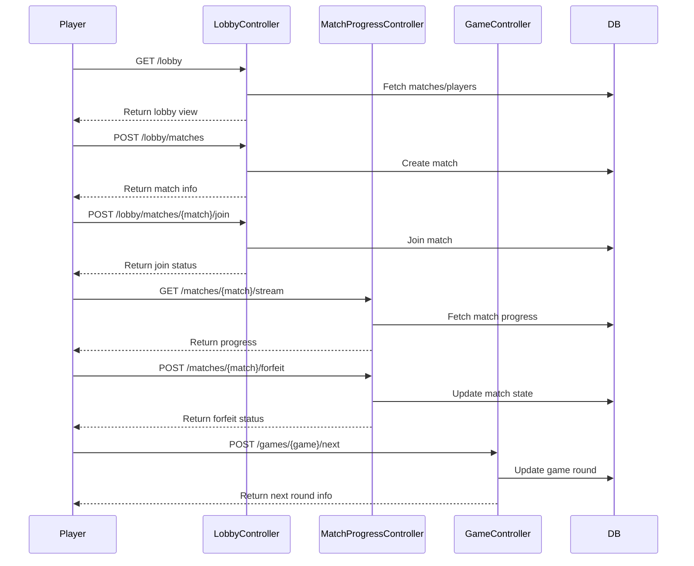

# High-Level Flowchart

# High-Level and Low-Level Implementation

## High-Level Overview

The multiplayer system is designed around RESTful HTTP endpoints, each mapped to a controller method. Players interact with the system via AJAX or frontend calls, triggering actions such as joining matches, streaming progress, or advancing game rounds. Controllers handle business logic, update the database, and return JSON responses.

**Key Concepts:**
- Player session management (middleware)
- Lobby for match discovery and creation
- Match progress and state management
- Game round advancement
- Real-time updates (polling or WebSocket-ready endpoints)

## Low-Level Implementation

**Routes:** Defined in routes/web.php, grouped by middleware for authenticated access.
- Each route maps to a controller method (e.g., LobbyController@join).
- Controllers interact with Eloquent models to query/update the database.
- Responses are returned as JSON for frontend consumption.

**Example:**
- POST /lobby/matches/{match}/join → LobbyController@join → DB update → JSON response

## Sequence Diagram

---
# Multiplayer Lobby & Match Routes Documentation

This document describes the multiplayer lobby and match-related HTTP endpoints implemented in the Laravel application. These routes are grouped under the `player.session` middleware, ensuring only authenticated players can access them.

## Lobby Endpoints

### GET /lobby
- **Controller:** LobbyController@index
- **Purpose:** Display the multiplayer lobby, showing available matches and players.
- **Route Name:** `lobby.index`

### POST /lobby/matches
- **Controller:** LobbyController@store
- **Purpose:** Create a new multiplayer match in the lobby.
- **Route Name:** `lobby.store`

### POST /lobby/matches/{match}/join
- **Controller:** LobbyController@join
- **Purpose:** Join an existing match in the lobby.
- **Route Name:** `lobby.join`

## Match Progress Endpoints

### GET /matches/{match}/stream
- **Controller:** MatchProgressController@stream
- **Purpose:** Stream real-time progress updates for a match (for polling or WebSocket integration).
- **Route Name:** `matches.stream`

### GET /matches/{match}/opponent
- **Controller:** MatchProgressController@opponent
- **Purpose:** Retrieve information about the opponent in the match.
- **Route Name:** `matches.opponent`

### POST /matches/{match}/forfeit
- **Controller:** MatchProgressController@forfeit
- **Purpose:** Forfeit the current match as the authenticated player.
- **Route Name:** `matches.forfeit`

### POST /matches/{match}/exit
- **Controller:** MatchProgressController@exit
- **Purpose:** Exit the current match (leave or abandon).
- **Route Name:** `matches.exit`

### GET /matches/{match}/status
- **Controller:** MatchProgressController@status
- **Purpose:** Get the current status and state of the match.
- **Route Name:** `matches.status`

## Game Endpoints (Protected)

### Resource: /games
- **Controller:** GameController
- **Purpose:** Standard CRUD operations for games (except edit).
- **Route Name Prefix:** `games.*`

### POST /games/{game}/next
- **Controller:** GameController@next
- **Purpose:** Proceed to the next round or word in the game.
- **Route Name:** `games.next`

### DELETE /games
- **Controller:** GameController@destroyAll
- **Purpose:** Clear all custom games from the session.
- **Route Name:** `games.destroyAll`

---

### Middleware
- **player.session:** Ensures only authenticated players can access these routes.

### Notes
- All endpoints return JSON responses suitable for AJAX or frontend consumption.
- Match endpoints are designed for multiplayer game state management and player actions.
- Lobby endpoints allow creation and joining of matches.
- Game endpoints manage game rounds and custom games.

---

For further details, see the respective controller methods and their implementation in the codebase.
